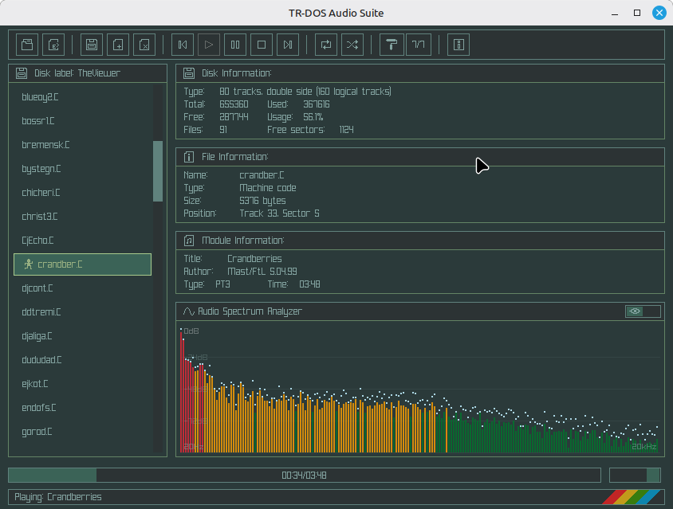

TR-DOS Audio Suite — это десктопное приложение для управления образами дисков TR-DOS (.trd) и прослушивания аудиомодулей из игр и демо ZX Spectrum. Приложение сочетает в себе редактор образов дисков с мощным аудиоплеером на базе движка ZXTune.


## Возможности


### Управление образами дисков

- Открытие, создание и редактирование образов дисков TR-DOS (.trd)
- Drag & drop поддержка для файлов и образов дисков
- Добавление и удаление файлов на образе диска
- Экспорт файлов с образа диска
- Автоматическое определение формата диска (80 дорожек, двусторонние)


### Аудио проигрывание

- Воспроизведение музыки с образов дисков TR-DOS
- Поддержка множества аудиоформатов через движок ZXTune:
  - AY/YM чиптюны (PT1/2/3, STC, ASC, и др.)
  - ZX Spectrum музыкальные модули
  - И многие другие форматы, поддерживаемые ZXTune
- Управление воспроизведением (Play, Pause, Stop, Previous, Next)
- Режимы повтора (Loop) и перемешивания (Shuffle)
- Ползунок позиции с отслеживанием прогресса
- Регулировка громкости


### Визуализация

- Спектроанализатор в реальном времени
- Информация о модуле (название песни, тип модуля, длительность)
- Информационная панель диска (свободные сектора, количество треков)


### Интерфейс и настройка

- Несколько цветовых тем:
  * Default (Raylib)
  * Amber
  * Ashes
  * Cyber
  * Dark
  * Genesis
  * Jungle
- Шрифт в стиле ZX Spectrum
- Изменяемый размер окна


## Коллекция музыки

Большую коллекцию образов дисков с музыкой для ZX Spectrum можно скачать на сайте Murmulator:
```

https://murmulator.ru/zxmusic

На сайте представлены тысячи треков в формате TR-DOS, готовых для использования с TR-DOS Audio Suite.


## Сборка из исходников

### Зависимости

- Lazarus / Free Pascal Compiler (FPC) 3.2+
- Ray4Laz - биндинги Raylib для Lazarus
- Raylib 4.0+
- RayGui
- ZXTune библиотека

### Используемые Pascal модули

- raylib - графика и работа с окном
- raygui - GUI элементы управления
- ray4laz - интеграция Raylib с Lazarus
- trdos_reader - работа с образами TR-DOS
- libzxtune - движок аудиопроигрывания
- TuneZXPlayer - обертка плеера
- SpectrumPanel - визуализация спектра

## Использование

### Основной workflow

1. Загрузите образ диска - Нажмите кнопку Open или перетащите файл .trd
2. Выберите файл - Кликните на любой файл в списке
3. Воспроизведение - Нажмите Play или дважды кликните по файлу
4. Экспорт - Выберите файл и нажмите Export для сохранения на диск

### Операции с дисками

Действие                 | Способ
-------------------------|-------------------------------
Открыть диск             | Нажмите Open или перетащите .trd файл
Создать новый диск       | Нажмите New Drive
Добавить файл на диск    | Нажмите Add File или перетащите файл в окно
Удалить файл             | Выберите файл -> Нажмите Delete
Экспортировать файл      | Выберите файл -> Нажмите Export

### Управление воспроизведением

Кнопка    | Действие
-----------|-------------------------------
Предыдущий трек
Воспроизвести / Продолжить
Пауза
Остановить
Следующий трек
Режим повтора
Режим перемешивания

## Лицензия

Проект лицензирован под MIT License.


## Благодарности

- ZXTune - Движок аудиопроигрывания
- Raylib - Графическая библиотека
- RayGui - GUI библиотека
- Документация по TR-DOS от сообщества ZX Spectrum
- Murmulator - За коллекцию музыки ZX Spectrum


## Ссылки

- Murmulator - Музыка для ZX Spectrum: https://murmulator.ru/zxmusic
- ZXTune Official: https://zxtune.bitbucket.io/
- raylib: https://github.com/raysan5/raylib
- ray4laz GitHub: https://github.com/guvacode/ray4laz

